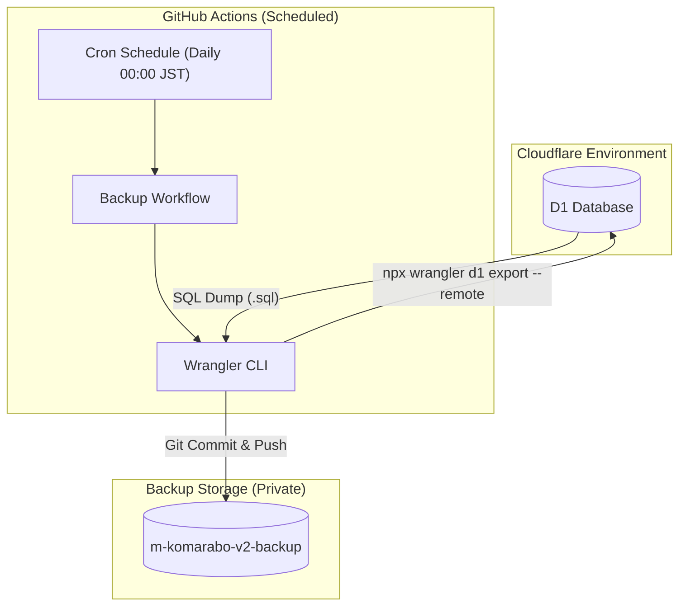

# 松谷の試作室 (Matsutani's Prototyping Studio)


2つの扉を持つ試作プラットフォームです。
Cloudflare Pages と D1 データベース、Hono フレームワークを使用して構築されています。

## 2つの扉

### 🔵 困りごとラボ (Komarabo)
**キャッチ**: 「その悩み、プロトタイプの種になる。」

街の課題（困りごと）を投稿し、共有するためのプラットフォーム。
市民や非ITの方の「不便」を投稿し、解決策を議論する場所です。

### 🎨 ワクワク試作室 (Waku-Waku Lab)
**キャッチ**: 「技術の無駄遣い、大歓迎。」

「誰が使うんだこれ（笑）」という尖ったアプリや、エンジニアの変執的なこだわりが詰まったプロダクトの展示室。

## プロジェクト構造と各ファイルの役割

- `functions/api/[[route]].ts`: APIサーバーの本体（Hono）。ルーティングとビジネスロジックを担当。
- `public/`: 静的ファイル（フロントエンド）を格納するディレクトリ。
  - `index.html`: ランディングページ（2つの扉を選択）
  - `komarabo.html`: 困りごとラボのメインUI。API（`/api/*`）をフェッチしてデータを表示。
  - `wakuwaku.html`: ワクワク試作室のプロダクト展示ページ。
  - `detail.html`: 課題詳細ページ。
  - `login.html`: ログイン/登録ページ。
- `wrangler.toml`: Cloudflare Pages の設定ファイル。ビルド設定やD1データベースの紐付けを行う。
- `package.json`: プロジェクトの依存関係と開発用スクリプトの定義。
- `.gitignore`: Gitの管理対象外ファイルを指定（node_modules, .wranglerなど）。

---

## ルーティングの仕組み (`functions/api/[[route]].ts`)

このプロジェクトでは、Cloudflare Pages の **Functions** 機能を活用しており、Hono を使用した高度なルーティングを行っています。

### `[[route]].ts` (Catch-all Route)
ファイル名を `[[route]].ts` とすることで、`/api/` 以下のすべてのサブパス（例: `/api/issues/list`, `/api/issues/post` など）がこの一つのファイルに集約されます。

```typescript
// functions/api/[[route]].ts
const app = new Hono().basePath('/api')

app.route('/issues', issues) // /api/issues/list や /api/issues/post などに対応
app.route('/wakuwaku', wakuwaku) // /api/wakuwaku/... に対応

export const onRequest = handle(app)
```

この構成により、フロントエンド側は `/api/issues/list` という簡潔なURLでバックエンドを整理された形で呼び出すことが可能です。

---

## データベース接続の仕組み (`D1 Database`)

Cloudflare のサーバーレスSQLデータベース **D1** を使用しています。

### `wrangler.toml` での定義
D1 データベースをコードから参照できるようにするために、`wrangler.toml` にバインディング（接続設定）を記述します。

```toml
[[d1_databases]]
binding = "DB" # コード内で c.env.DB として参照するための名前
database_name = "your-database-name"
database_id = "your-database-id"
```

### コード内での利用
Hono のコンテキストを通じて、バインド名（`DB`）を指定してデータベースを操作します。

```typescript
// SQLの実行例
const { results } = await c.env.DB.prepare('SELECT * FROM issues').all()
```

---

## 開発とデプロイ

### ローカル開発
```bash
npm run dev
```
`wrangler pages dev public` が実行され、ローカルサーバー（http://localhost:8788）が立ち上がります。

### デプロイ
```bash
npm run deploy
```
Cloudflare Pages へプロジェクト全体をデプロイします。

---

## テストと品質管理

プロジェクトの品質を維持し、デグレード（先祖返り）を防止するために、バックエンドとフロントエンドの両方で自動テストを導入しています。

### 🚨 テストの実行方法

#### 1. バックエンド・ロジックテスト (Vitest)
APIの権限チェック、バリデーション、ビジネスロジックをテストします。データベースはメモリ内のモックを使用するため高速に動作します。

```bash
npm run test
```

#### 2. フロントエンド E2E テスト (Playwright)
実際のブラウザを操作して、画面遷移やUIの振る舞いを確認します。

```bash
npm run test:e2e
```

#### 3. カバレッジ（網羅率）の確認
コードのどの部分がテストされているかを確認できます。

```bash
npm run coverage
```

#### 4. 静的解析と保守性 (Lint & Typecheck)
コードのスタイルガイドへの準拠と、型定義の不整合をチェックします。開発中にエラーを未然に防ぐための重要なステップです。

```bash
# 静的解析（ESLint）の実行
npm run lint

# 型チェック（TypeScript）の実行
npm run typecheck
```

#### 5. まとめてチェック (Full Verification)
デプロイ前やCIでの利用を想定した、Lint・Typecheck・Testをすべて一括で実行するコマンドです。

```bash
npm run check
```

### 📊 テスト結果の確認方法

Playwright（E2Eテスト）を実行した後、以下のコマンドで視覚的なレポートを確認できます。
どの画面で何が起きてパスしたか（あるいは失敗したか）をブラウザで詳細に確認可能です。

```bash
npx playwright show-report
```

---

## データベースバックアップ

システムの継続性を確保するため、データの自動バックアップ体制を構築しています。

### 🔄 自動バックアップの仕組み

GitHub Actions を利用して、定期的に D1 データベースの内容を SQL 形式でエクスポートし、専用のプライベートリポジトリに保存しています。



### 📁 バックアップ詳細

- **実行タイミング**: 毎日 00:00 (JST)
- **保存形式**: `.sql` ファイル（スキーマ定義 + インサート文）
- **バックアップ先**: [matsutanishimpei/m-komarabo-v2-backup](https://github.com/matsutanishimpei/m-komarabo-v2-backup.git)（Private Repo）

### 🛠️ 復元手順

万が一の障害時には、バックアップリポジトリから最新の SQL ファイルを取得し、以下のコマンドで復旧を行います。

> [!CAUTION]
> 復元は既存のデータを上書き、あるいは重複させる可能性があるため、原則として空のデータベースに対して実行してください。

```bash
# リモート（本番）の D1 に復元
npx wrangler d1 execute m-komarabo-v2-db --remote --file=backup_yyyymmdd.sql
```

---

## 📚 ドキュメント (Documents)

### 📖 開発者向けドキュメント
詳細な設計・仕様については [プロジェクト全容（正典）](./docs/DOCS_SUMMARY.md) を参照してください。
- アーキテクチャ図（Mermaid）
- データベース設計（ER図）
- 全APIエンドポイント詳細

### 📂 個別仕様・設計
- [API仕様書](./docs/API_SPECIFICATION.md) - エンドポイント詳細・型定義
- [データベース設計 (ER図)](./docs/er_diagram.md) - テーブル構造とリレーション
- [クラス図](./docs/class_diagram.md) - モジュール構成と依存関係
- [セキュリティ・レポート](./docs/SECURITY_AUDIT_REPORT.md) - 脆弱性診断・対策結果

---

## ライセンス (License)

このプロジェクトは **MIT ライセンス** の下で公開されています。  
詳細は [LICENSE](./LICENSE) ファイルをご覧ください。

Copyright (c) 2026 Shimpei Matsutani
