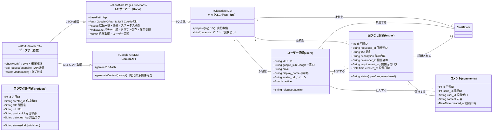

```mermaid
classDiagram
    direction LR
    
    class Browser_Frontend ["ブラウザ（画面）"] {
        <<HTML/Vanilla JS>>
        +checkAuth() JWT・権限検証
        +apiRequest(endpoint) API通信
        +switchMode(mode) タブ切替
    }

    class Hono_API_Handler ["APIサーバー（Hono）"] {
        <<Cloudflare Pages Functions>>
        +basePath: /api
        +/auth  Google OAuth & JWT Cookie発行
        +/issues  課題一覧・投稿・ステータス更新
        +/wakuwaku  ガチャ生成・ドラフト保存・作品封印
        +/admin  統計取得・ユーザー管理
    }

    class Gemini_API ["Gemini API"] {
        <<Google AI SDK>>
        +gemini-2.5-flash
        +generateContent(prompt) 開発対話/要件定義
    }

    class D1_Database ["バックエンドDB（D1）"] {
        <<Cloudflare D1>>
        +prepare(sql) SQL実行準備
        +bind(params) バインド変数セット
    }

    class User ["ユーザー情報(users)"] {
        +String id UUID
        +String google_sub Google一意ID
        +String email
        +String display_name 表示名
        +String avatar_url アイコン
        +String role (user/admin)
        +Bool is_active
    }

    class Issue ["困りごと投稿(issues)"] {
        +Int id 内部ID
        +String requester_id 依頼者ID
        +String title 題名
        +String description 詳細内容
        +String status (open/progress/closed)
        +String developer_id 担当者ID
        +String requirement_log 要件定義ログ
        +DateTime created_at 投稿日時
    }

    class Product ["ワクワク試作室(products)"] {
        +Int id 内部ID
        +String creator_id 作成者ID
        +String title 製品名
        +String url URL
        +String status (draft/published)
        +String protocol_log 仕様書
        +String dialogue_log 対話ログ
    }

    class Comment ["コメント(comments)"] {
        +Int id 内部ID
        +Int issue_id 課題ID
        +String user_id 投稿者ID
        +String content 内容
        +DateTime created_at 投稿日時
    }

    Browser_Frontend --|> Hono_API_Handler : JSON通信
    Browser_Frontend --|> Gemini_API : AIコメント取得
    Hono_API_Handler --|> D1_Database : SQL発行
    D1_Database "1" -- "*" User : 永続化
    D1_Database "1" -- "*" Issue : 永続化
    D1_Database "1" -- "*" Certificate : 永続化
    User "1" -- "*" Issue : 投稿する
    User "1" -- "*" Certificate : 解決する
    Issue "1" -- "0..1" Certificate : 証明される
    User "1" -- "*" Comment : 記入する
    Issue "1" -- "*" Comment : 保持する
```
