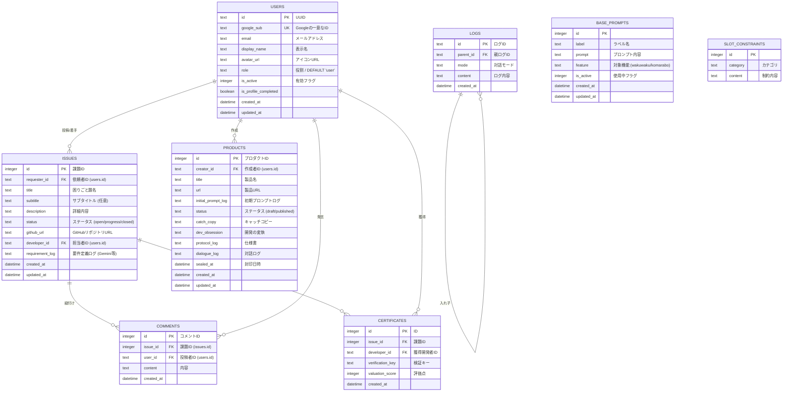

# 困りごとラボ プロジェクト全容（正典）

このドキュメントは「松谷の試作室」プロジェクトのアーキテクチャ、機能、データ構造、およびAPI仕様を網羅した公式サマリーです。  
**最終更新日:** 2026-04-08

## 1. アーキテクチャ概要

本プロジェクトは Cloudflare のエコシステムをフル活用した、モダンなサーバーレスWebアプリケーションです。

- **Frontend**: HTML5 / Vanilla JS / Tailwind CSS (CDN)
  - Cloudflare Pages にホストされ、高速な配信を実現。
- **Backend**: Hono (Web standard framework)
  - Cloudflare Pages Functions 上で動作。超軽量かつ高速なルーティングを提供。
- **Database**: Cloudflare D1 (SQLite-based)
  - フルマネージドなサーバーレスリレーショナルデータベース。
- **AI Integration**: Gemini API
  - 課題の要件定義ログ生成や、試作室でのプロトタイプシード(Ideation)生成などに活用。

---

## 2. 実装済み機能

### 🔐 認証システム（Google OAuth + JWT）
現在のシステムは、利便性とセキュリティを考慮して **Google OAuth 2.0** を用いた認証基盤（JWT Cookie ベース）を採用しています。

1.  **Google OAuth**: 
    - ユーザーはGoogleアカウントで安全にログイン可能。
    - サーバー側で取得した情報をもとに内部の `users` テーブルへUpsert処理を行います。
    - CSRF対策として nonce Cookie と state パラメータを照合（RFC 6749 Section 10.12 準拠）。
2.  **JWT + Cookie セッション**:
    - 認証成功後、サーバーはユーザー情報を含んだ JWT (`auth_token`) を発行します（有効期限7日）。
    - トークンは `HttpOnly; Secure; SameSite=Lax` 属性を持つ強固な Cookie としてセットされ、XSSによる抜き取りを防ぎます。
- **ロールベースアクセス制限 (RBAC)**: 一般ユーザー・管理者(`admin`)の権限管理をミドルウェア（`authMiddleware`, `adminGuard`）で制御。`authMiddleware` はリクエストごとにDBで `is_active` を確認し即時アカウント無効化に対応しています。

### 🏠 コマラボ (相談者モード / 開発者モード)
- **マイ・ダッシュボード**: 自分の投稿をステータスごとに3カラム（未着手 / 進行中 / 解決済み）で整理して表示。
- **課題投稿・詳細閲覧**: タイトル・サブタイトル・説明を含む課題の投稿、詳細画面の閲覧、およびGeminiによる要件定義ログの確認・編集が可能。
- **着手（挙手）機能**: 開発者が課題に「着手(progress)」し、担当者として名乗り出ることが可能。担当解除時は自動コメントを挿入し透明性を確保。
- **パブリック閲覧**: 未ログインユーザーでも、投稿された課題の一覧や詳細は閲覧可能なオープンな仕様です。

### 🎨 ワクワク試作室 (Ideation / Development)
- **Ideation (01)**: プロンプトジェネレータ（制約スロット付き）を利用して、AIの力でアプリの初期構想を練る機能。
- **Development (02)**: ドラフトを保存し、最終的に「AIとの対話ログ」「仕様書」「URL」を付与してプロダクトを封印（公開）します。
- **Gallery**: 未ログインでも閲覧できる、公開（封印）済みプロダクトのアーカイブ一覧ギャラリー。
- **削除機能**: 作成者本人がプロダクトを削除可能。

### 🛡️ 管理者ダッシュボード
- **ユーザー管理**: ユーザーの一覧、有効/無効の切り替え、管理者権限の付与・剥奪。
- **コンテンツ管理**: 全体の統計データ、最近のアクティビティ閲覧。
- **プロンプト管理**: Wakuwakuの「ベースプロンプト」や「制約スロット」、Komaraboの「要件定義プロンプト」の編集・追加・インポート。アクティブなコマラボプロンプトを1件に絞り込む専用APIあり。

---

## 3. データベース設計 (ER図)



---

## 4. クラス図 / システム構成図

```mermaid
classDiagram
    direction LR
    
    class Browser_Frontend ["フロントエンド (Public)"] {
        <<HTML/Vanilla JS>>
        +checkAuth() JWTセッション検証
        +apiRequest() Cookie付きFetch
    }

    class Hono_API_Handler ["API エンドポイント (Hono)"] {
        <<Cloudflare Pages Functions>>
        +app.route('/auth')
        +app.route('/issues')
        +app.route('/wakuwaku')
        +app.route('/admin')
    }

    class D1_Database ["バックエンドデータベース (D1)"] {
        +users
        +issues, comments, certificates
        +products
        +base_prompts, slot_constraints
        +logs
    }

    Browser_Frontend --> Hono_API_Handler : JSON (w/ JWT Cookie)
    Hono_API_Handler --> D1_Database : SQL (Bind Params)

---

## 5. プロジェクト構造

```text
m-komarabo-v2/
├── .github/workflows/   # CI/CD (lint, typecheck, test, backup)
├── docs/                # プロジェクトドキュメント
├── functions/           # Hono API (Backend)
├── public/              # フロントエンド静的ファイル
└── tests/               # E2Eテスト
```

## 6. API エンドポイント仕様（概要）

主要なルーティング構成（`[[route]].ts` より）：

| 分類 | メソッド | パス | 認証・権限 | 説明 |
| :--- | :--- | :--- | :--- | :--- |
| **Auth** | GET | `/api/auth/google` | Public | Google OAuth リダイレクト開始 |
| **Auth** | GET | `/api/auth/callback` | Public | OAuth コールバック・JWT発行 |
| **Auth** | GET | `/api/auth/me` | Public | 認証状態・ユーザー情報取得 |
| **Auth** | POST | `/api/auth/profile` | ログイン必須 | 表示名更新・JWT再発行 |
| **Auth** | POST | `/api/auth/logout` | Public | ログアウト（Cookie削除） |
| **Issues** | GET | `/api/issues/list` | Public | 課題一覧取得 |
| **Issues** | GET | `/api/issues/detail` | Public | 課題詳細＋コメント取得 |
| **Issues** | GET | `/api/issues/requirement-prompt` | Public | 要件定義プロンプト取得 |
| **Issues** | POST | `/api/issues/post` | ログイン必須 | 課題投稿 |
| **Issues** | POST | `/api/issues/update-status` | ログイン必須 | 課題の着手・クローズ |
| **Issues** | POST | `/api/issues/unassign` | ログイン必須 | 担当者解除 |
| **Issues** | POST | `/api/issues/comment` | ログイン必須 | コメント投稿 |
| **Issues** | POST | `/api/issues/delete` | ログイン必須 | 課題削除 |
| **Issues** | POST | `/api/issues/update-requirement` | ログイン必須 | 要件定義ログ更新 |
| **Issues** | POST | `/api/issues/update-subtitle` | ログイン必須 | サブタイトル更新 |
| **Waku** | GET | `/api/wakuwaku/products` | Public | 封印済み試作品アーカイブ一覧 |
| **Waku** | GET | `/api/wakuwaku/product/:id` | Public | プロダクト詳細 |
| **Waku** | GET | `/api/wakuwaku/base-prompts` | Public | ベースプロンプト一覧 |
| **Waku** | GET | `/api/wakuwaku/constraints/random` | Public | ランダム制約スロット取得 |
| **Waku** | GET | `/api/wakuwaku/drafts` | ログイン必須 | マイドラフト一覧 |
| **Waku** | POST | `/api/wakuwaku/drafts` | ログイン必須 | ドラフト新規作成 |
| **Waku** | POST | `/api/wakuwaku/drafts/save` | ログイン必須 | ドラフト保存 |
| **Waku** | POST | `/api/wakuwaku/seal` | ログイン必須 | 試作品の封印（公開） |
| **Waku** | POST | `/api/wakuwaku/delete-product` | ログイン必須 | プロダクト削除 |
| **Waku** | POST | `/api/wakuwaku/unseal` | 👑 Admin | 封印解除（下書きに戻す） |
| **Admin** | GET | `/api/admin/check` | 👑 Admin | 管理者チェック |
| **Admin** | GET | `/api/admin/stats` | 👑 Admin | サイト統計 |
| **Admin** | GET | `/api/admin/users` | 👑 Admin | ユーザー一覧 |
| **Admin** | GET | `/api/admin/recent-activity` | 👑 Admin | 最近のアクティビティ |
| **Admin** | POST | `/api/admin/users/toggle-role` | 👑 Admin | ユーザー権限切り替え |
| **Admin** | POST | `/api/admin/users/toggle-active` | 👑 Admin | ユーザー有効/無効切り替え |
| **Admin** | GET | `/api/admin/base-prompts/list` | 👑 Admin | プロンプト一覧 |
| **Admin** | POST | `/api/admin/base-prompts/save` | 👑 Admin | プロンプト保存 |
| **Admin** | POST | `/api/admin/base-prompts/delete` | 👑 Admin | プロンプト削除 |
| **Admin** | POST | `/api/admin/base-prompts/activate-komarabo` | 👑 Admin | コマラボ用アクティブ切替 |
| **Admin** | POST | `/api/admin/base-prompts/import` | 👑 Admin | プロンプト一括インポート |
| **Admin** | GET | `/api/admin/constraints/list` | 👑 Admin | 制約スロット一覧 |
| **Admin** | POST | `/api/admin/constraints` | 👑 Admin | 制約スロット追加 |
| **Admin** | POST | `/api/admin/constraints/delete` | 👑 Admin | 制約スロット削除 |
| **Admin** | POST | `/api/admin/constraints/import` | 👑 Admin | 制約スロット一括インポート |
