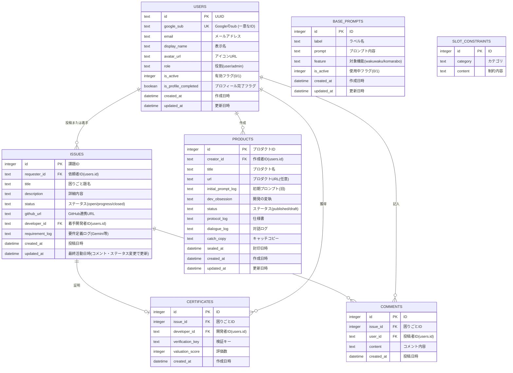

```mermaid
erDiagram
    USERS {
        text id PK "UUID"
        text google_sub UK "Googleのsub (一意なID)"
        text email "メールアドレス"
        text display_name "表示名"
        text avatar_url "アイコンURL"
        text role "役割(user/admin)"
        integer is_active "有効フラグ(0/1)"
        boolean is_profile_completed "プロフィール完了フラグ"
        datetime created_at "作成日時"
        datetime updated_at "更新日時"
    }

    ISSUES {
        integer id PK "課題ID"
        text requester_id FK "依頼者ID(users.id)"
        text title "困りごと題名"
        text description "詳細内容"
        text status "ステータス(open/progress/closed)"
        text github_url "GitHub連携URL"
        text developer_id FK "着手開発者ID(users.id)"
        text requirement_log "要件定義ログ(Gemini等)"
        datetime created_at "投稿日時"
        datetime updated_at "最終活動日時(コメント・ステータス変更で更新)"
    }

    CERTIFICATES {
        integer id PK "ID"
        integer issue_id FK "困りごとID"
        text developer_id FK "開発者ID(users.id)"
        text verification_key "検証キー"
        integer valuation_score "評価数"
        datetime created_at "作成日時"
    }

    COMMENTS {
        integer id PK "ID"
        integer issue_id FK "困りごとID"
        text user_id FK "投稿者ID(users.id)"
        text content "コメント内容"
        datetime created_at "投稿日時"
    }

    PRODUCTS {
        integer id PK "プロダクトID"
        text creator_id FK "作成者ID(users.id)"
        text title "プロダクト名"
        text url "プロダクトURL(任意)"
        text initial_prompt_log "初期プロンプト(旧)"
        text dev_obsession "開発の変執"
        text status "ステータス(published/draft)"
        text protocol_log "仕様書"
        text dialogue_log "対話ログ"
        text catch_copy "キャッチコピー"
        datetime sealed_at "封印日時"
        datetime created_at "作成日時"
        datetime updated_at "更新日時"
    }

    
    BASE_PROMPTS {
        integer id PK "ID"
        text label "ラベル名"
        text prompt "プロンプト内容"
        text feature "対象機能(wakuwaku/komarabo)"
        integer is_active "使用中フラグ(0/1)"
        datetime created_at "作成日時"
        datetime updated_at "更新日時"
    }

    SLOT_CONSTRAINTS {
        integer id PK "ID"
        text category "カテゴリ"
        text content "制約内容"
    }

    USERS ||--o{ ISSUES : "投稿または着手"
    ISSUES ||--o| CERTIFICATES : "証明"
    USERS ||--o{ CERTIFICATES : "獲得"
    ISSUES ||--o{ COMMENTS : "紐付き"
    USERS ||--o{ COMMENTS : "記入"
    USERS ||--o{ PRODUCTS : "作成"
```
